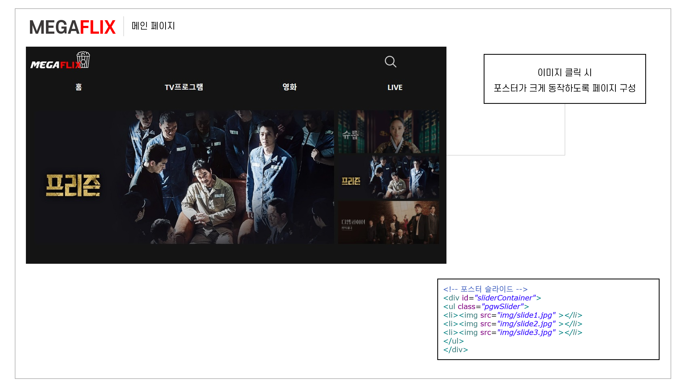
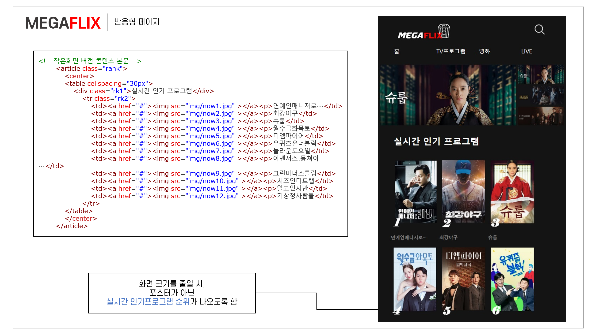
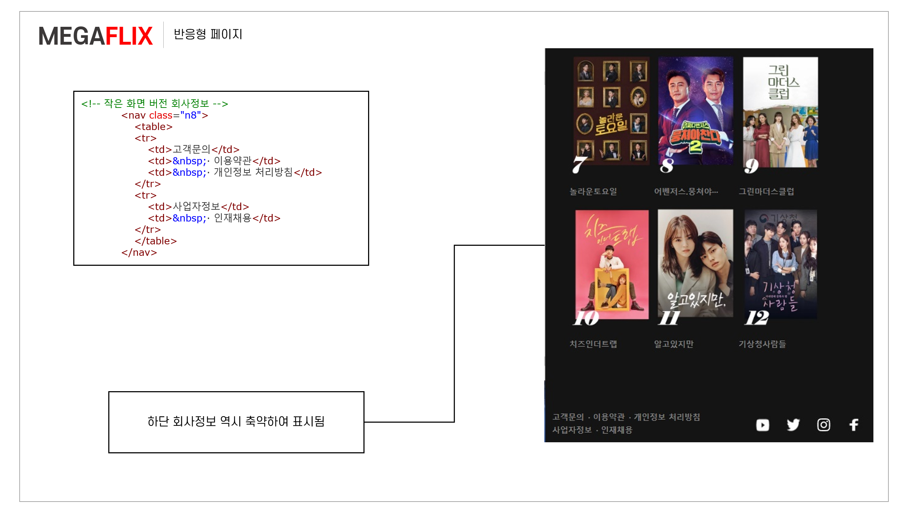

> ### 드라마, 영화, 예능, 애니메이션 등 다양한 컨텐츠를 시간과 장소에 구애없이 즐길 수 있는 다목적 OTT 사이트
 

## MEGAFLIX란
'거대한'을 뜻하는 **MEGA**와, 영화를 뜻하는 **Flicks**의 합성어로  
**집 안의 거대한 영화관**을 구현하는 OTT 사이트

 

### 개발 목적
---
&nbsp;집에서 보낼 수 있는 여가 중 가장 대중적인 것은 아마도 **영화, 드라마 시청**일 것이다.  
 같은 시대의 시청자들이 서로 **소통**하며  **정보를 공유**해나가는 OTT 커뮤니케이션 사이트를 구현하고자 하였다.
  

### 주요 기능
---
📌 브라우저 크기를 조절함에 따라 보이는 화면이 달라지는 **반응형 웹사이트**  
📌 일정 시간마다 메인 포스터가 바뀌는 **포스터 슬라이드**

 

## 메인 페이지

  

## 반응형 페이지

 

### See more . . .

1. git clone `https://github.com/yerin305/megaflix`

2. `main.html` 열기
